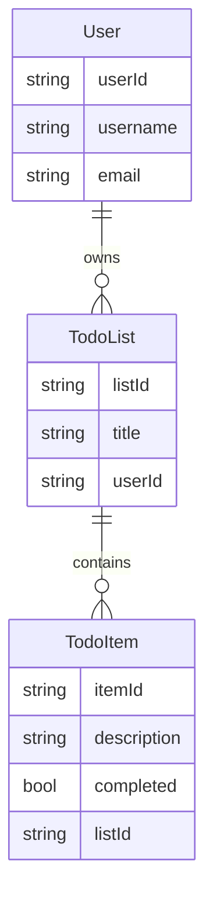

```mermaid
erDiagram
    User {
        string userId
        string username
        string email
    }

    TodoList {
        string listId
        string title
        string userId
    }

    TodoItem {
        string itemId
        string description
        bool completed
        string listId
    }

    User ||--o{ TodoList : "owns"
    TodoList ||--o{ TodoItem : "contains"
```